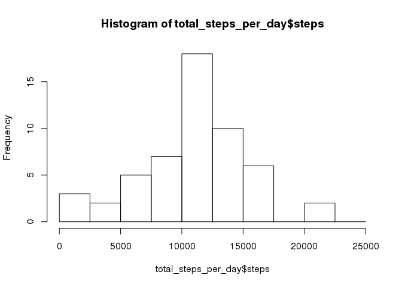
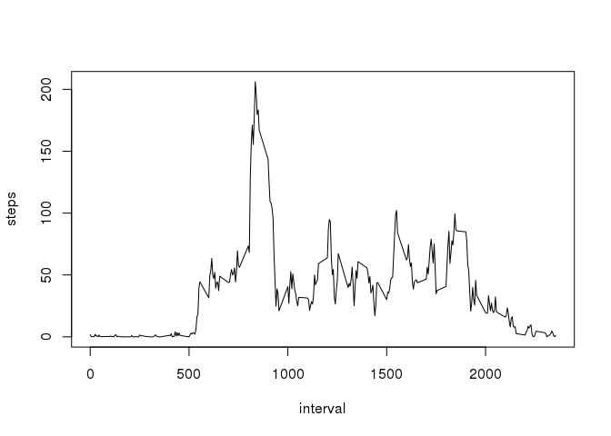
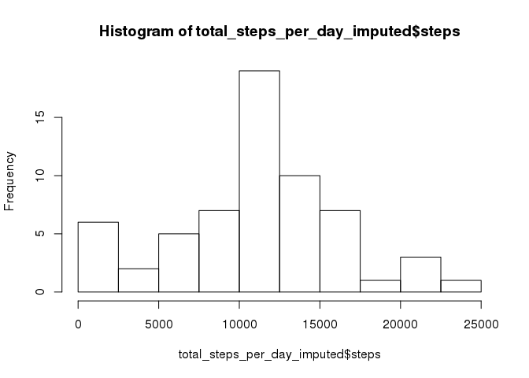
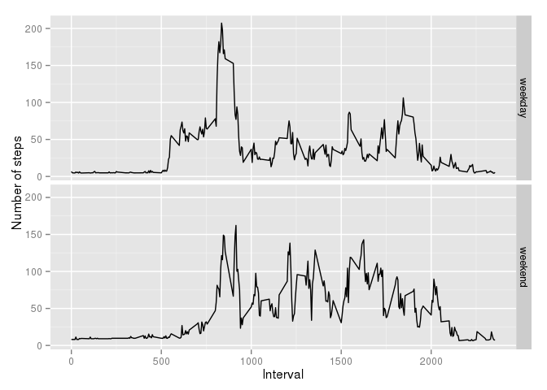

# Reproducible Research: Peer Assessment 1


## Loading and preprocessing the data
Unzip the data, read into R and prepare a version where the NAs are removed

```r
unzip(file.path(getwd(), 'activity.zip'))
data <- read.csv(file.path(getwd(), 'activity.csv'))
data_clean <- na.omit(data)
```


## What is mean total number of steps taken per day?
We calculate the number of steps per day and show a histogram of the distribution.

```r
total_steps_per_day <- aggregate(steps ~ date, data_clean, sum)
hist(total_steps_per_day$steps,seq(0, 25000, by=2500))
```

 

The mean and median total steps per day are:

```r
mean(total_steps_per_day$steps)
```

```
## [1] 10766.19
```

```r
median(total_steps_per_day$steps)
```

```
## [1] 10765
```

## What is the average daily activity pattern?
Create a plot of the "average" day:

```r
avg_per_interval <- aggregate(steps ~ interval, data_clean, mean)
plot(avg_per_interval, type='l')
```

 

The interval in which the most steps occur is:

```r
max_interval <- avg_per_interval[avg_per_interval$steps==max(avg_per_interval$steps),]
max_interval
```

```
##     interval    steps
## 104      835 206.1698
```

## Imputing missing values
The number of incomplete entries:

```r
not_complete <- !complete.cases(data)
sum(not_complete)
```

```
## [1] 2304
```

We impute values by taking the average per the interval, as this is readily available.

```r
data_imputed <- data
tmp <- merge(x = data, y = avg_per_interval, by = "interval", all.x=TRUE)
data_imputed$steps[not_complete] <-tmp$steps.y[not_complete]
```

Histogram of total steps per day:

```r
total_steps_per_day_imputed <- aggregate(steps ~ date, data_imputed, sum)
hist(total_steps_per_day_imputed$steps,seq(0, 25000, by=2500))
```

 

The mean and median of the imputed data

```r
mean(total_steps_per_day_imputed$steps)
```

```
## [1] 10889.8
```

```r
median(total_steps_per_day_imputed$steps)
```

```
## [1] 11015
```
The differences with the non-imputed outcomes are negligible.

## Are there differences in activity patterns between weekdays and weekends?
For each observation, we determine whether it is a weekday or weekend. Thereafter, we make a line-plot with two panels, one for weekdays and one for weekend.

```r
 classification <- c(Monday='weekday',
                     Tuesday='weekday', 
                     Wednesday='weekday',
                     Thursday='weekday',
                     Friday='weekday',
                     Saturday='weekend',
                     Sunday='weekend')
data_imputed$day_of_the_week <- factor(classification[weekdays(as.Date(data_imputed$date))])

library(ggplot2)
g <- ggplot(data_imputed, aes(interval, steps)) + stat_summary(fun.y="mean" ,geom="line")+facet_grid(day_of_the_week ~ .)
g <- g + labs(x="Interval", y="Number of steps")
g
```

 

We see that there are some differences, especially around intervals 800-900. This is probably in the morning where the subject has to go to work. Hence the high and consistent amount of steps.
